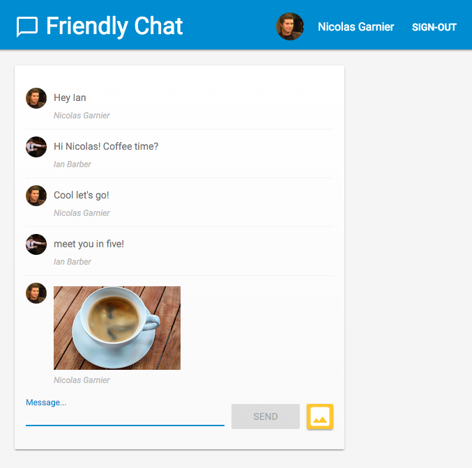

# Firebase Web Codelab

## 1. Overview
In this codelab, I will use Firebase to easily create web applications by implementing and deploying a chat client using Firebase products and services.

For more informations, go to the [Codelab page](https://firebase.google.com/codelabs/firebase-web#0).

## 2. Features
- Sync data using Cloud Firestore and Cloud Storage for Firebase.
- Authenticate users using Firebase Authentication.
- Deploy this web app on Firebase Hosting.
- Send notifications with Firebase Cloud Messaging.
- Collect web app's performance data.

## 3. Prerequisites
- The IDE/text editor of your choice, such as WebStorm, Atom, Sublime, or VS Code
- The package manager npm, which typically comes with Node.js
A terminal/console
- A browser of your choice, such as Chrome
- The codelab's sample code (See the next step for how to get the code.)

## 4. How to run this app locally.

1. Open the terminal.

2. Enter `git clone https://github.com/othman-19/friendlychat-firebase-codelab.git`.

3. In the terminal cd into codelab-friendlychat-web/web-start.

4. Run `npm install` in your terminal.

5. Create and set up a Firebase project by following these steps => [Firebase project](https://firebase.google.com/codelabs/firebase-web#2).

6. Install the Firebase command-line interface by following these steps => [Firebase command-line](https://firebase.google.com/codelabs/firebase-web#3).

7. Authorize the Firebase CLI by running the following command: `firebase login`.

8.  Run the starter app locally by typing `firebase serve --only hosting` in the terminal.

9. Using your browser, open your app at [http://localhost:5000](http://localhost:5000) to view it in the browser.

10. Sign Up with google, send text messages and images.

